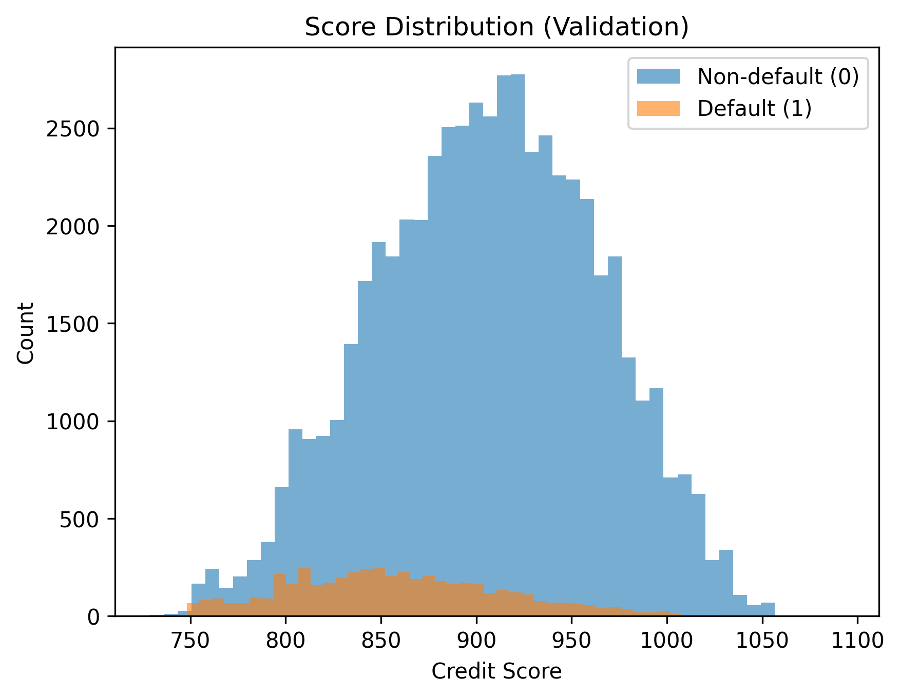
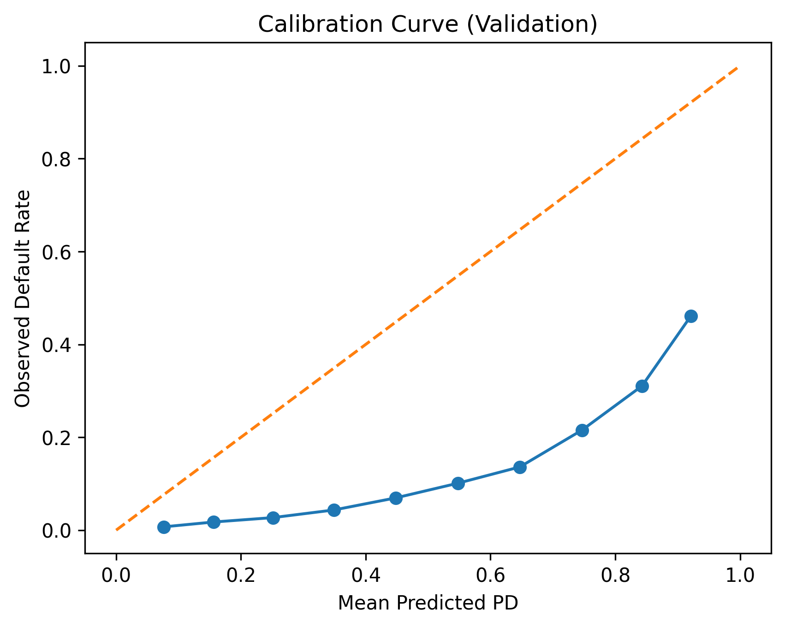
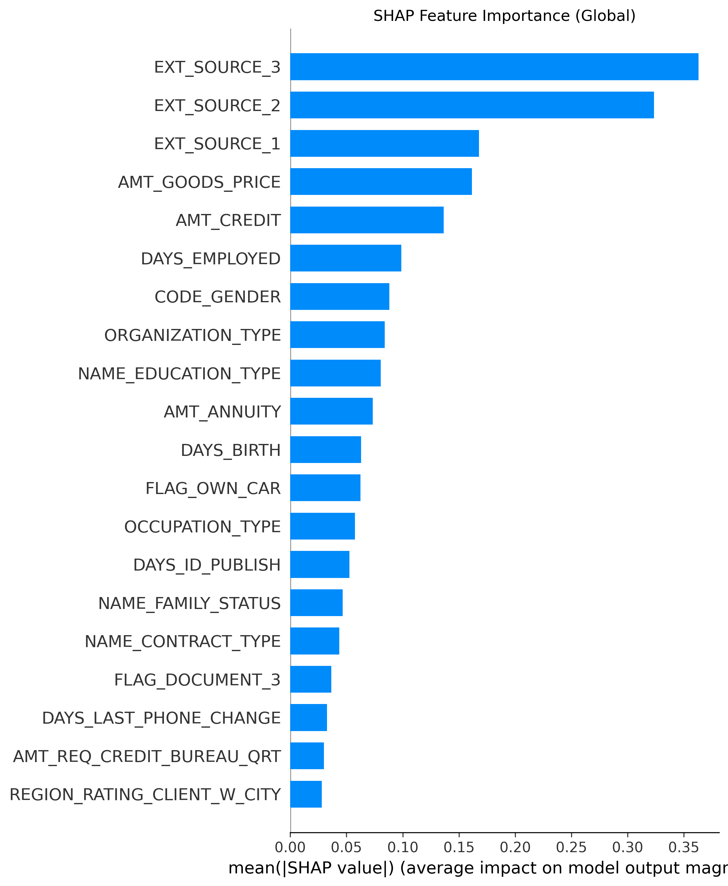
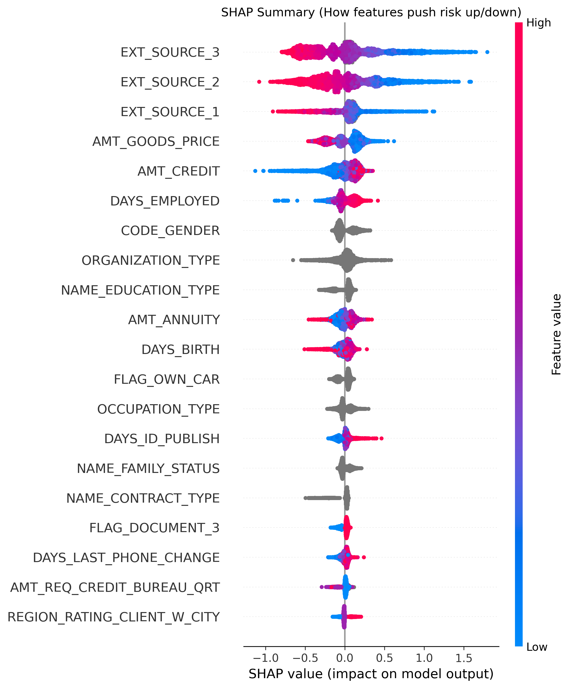

# Credit Risk Modeling – Home Credit Default Risk

This repository presents a complete end-to-end credit risk modeling workflow using the **Home Credit Default Risk** dataset.

The objective is to predict **Probability of Default (PD)** and compare traditional banking models with modern machine learning approaches.

---

# Dataset

## Source

The dataset comes from the Kaggle competition:

**Home Credit Default Risk**  
https://www.kaggle.com/competitions/home-credit-default-risk

It contains anonymized loan application data provided by Home Credit Group.

---

## Business Context

Home Credit provides loans to clients with limited credit history.  
The goal is to predict whether a client will default on a loan.

Target variable:

- `TARGET = 1` → Client defaulted  
- `TARGET = 0` → Client repaid  

This is a **binary classification problem with class imbalance**, which is typical in credit risk modeling.

---

# Exploratory Data Analysis (EDA)

Before modeling, extensive EDA was conducted to understand:

- Data quality
- Feature distributions
- Missing values
- Target imbalance
- Key risk drivers

---

## 1. Target Distribution

The dataset is **imbalanced**, with significantly more non-defaults than defaults.

This confirms the need for:
- PR-AUC metric
- Careful probability calibration
- Possibly class weighting

---

## 2. Missing Values Analysis

Many variables (especially bureau-related and external scores) contain missing values.

Approach:
- Numerical features → median imputation
- Categorical features → explicit `"MISSING"` category
- Scorecard model → WOE binning handles missing as separate bin

This mirrors real banking practice.

---

## 3. Feature Distributions

Key continuous variables analyzed:

- AMT_CREDIT
- AMT_GOODS_PRICE
- AMT_ANNUITY
- DAYS_EMPLOYED
- DAYS_BIRTH
- EXT_SOURCE_1 / 2 / 3

Findings:

- External risk scores (EXT_SOURCE variables) show strong separation between good and bad clients.
- Credit amount and goods price correlate with risk exposure.
- Age (DAYS_BIRTH) shows nonlinear relationship with default.

---

## 4. Correlation & Multicollinearity

- Strong correlation among EXT_SOURCE variables.
- AMT_CREDIT and AMT_GOODS_PRICE highly correlated.
- Logistic model regularization helps control multicollinearity.

---

## 5. Business Insights from EDA

- External risk scores are dominant predictors.
- Higher loan amounts increase risk exposure.
- Younger clients show higher default probability.
- Some categorical variables (education, occupation) show meaningful segmentation.

EDA guided:

- Feature selection
- WOE binning strategy
- Model design decisions

---

# Project Goal

Build and compare three modeling approaches:

1. Logistic Regression (Baseline Pipeline)
2. WOE-based Credit Scorecard (Banking-style model)
3. LightGBM (Gradient Boosting benchmark)

Evaluate them using:

- ROC-AUC
- PR-AUC
- KS Statistic
- Calibration analysis
- SHAP explainability

---

# Models

## 1. Logistic Regression (Baseline Pipeline)

- Feature preprocessing
- Encoding
- Regularized logistic regression
- Outputs predicted Probability of Default

Strengths:
- Simple
- Stable
- Regulatory-friendly

---

## 2. WOE Credit Scorecard

Steps:
- Feature binning
- Weight of Evidence transformation
- Logistic regression on WOE variables
- Conversion to credit score scale

This is the **traditional banking approach**, highly interpretable and widely used in financial institutions.

---

## 3. LightGBM

- Gradient Boosting Decision Trees
- Captures nonlinear interactions
- Strong predictive performance
- Interpreted using SHAP values

---

# Model Comparison (Validation Set)

| Model | ROC-AUC | PR-AUC | KS |
|-------|---------|--------|------|
| Logistic (Pipeline) | 0.7489 | 0.2287 | 0.3682 |
| WOE Scorecard | 0.7227 | 0.1917 | 0.3341 |
| LightGBM | 0.7605 | 0.2526 | 0.3868 |

LightGBM achieves the strongest discrimination performance.

---

# Metric Definitions & Interpretation

## ROC-AUC (Receiver Operating Characteristic – Area Under Curve)

Measures how well the model ranks defaulters above non-defaulters.

- 0.5 → Random
- 1.0 → Perfect
- ~0.75 → Strong credit model

Here, all models perform well. LightGBM performs best.

---

## PR-AUC (Precision-Recall AUC)

More informative for imbalanced datasets.

Precision = Of predicted defaults, how many are true defaults  
Recall = Of actual defaults, how many are captured  

LightGBM performs best, showing better minority-class performance.

---

## KS Statistic (Kolmogorov-Smirnov)

Common in banking.

KS = Maximum separation between cumulative bad rate and cumulative good rate.

Interpretation:
- < 0.2 → Weak
- 0.2–0.4 → Good
- > 0.4 → Very strong

All models show good discriminatory power.

---

# Evaluation Plots

---

## Score Distribution (Validation)



Shows separation between default and non-default clients.

- Clear separation
- Some overlap expected
- Higher scores → lower risk

---

## Calibration Curve



Compares predicted PD with observed default rate.

- Model underestimates high PD risk
- Calibration adjustment may be required for production

---

## SHAP Feature Importance



Global feature impact ranking.

Top drivers:
- EXT_SOURCE_3
- EXT_SOURCE_2
- EXT_SOURCE_1
- AMT_GOODS_PRICE
- AMT_CREDIT

External risk scores dominate prediction power.

---

## SHAP Summary Plot



Explains direction of impact.

- Red → High feature value
- Blue → Low feature value
- Right → Increases risk
- Left → Decreases risk

Provides transparency and interpretability.

---


# Requirements

Python 3.11+

Main libraries:

- numpy
- pandas
- scikit-learn
- lightgbm
- shap
- matplotlib
- seaborn

Install:

```
pip install numpy pandas scikit-learn lightgbm shap matplotlib seaborn
```

---

# Key Takeaways

- LightGBM achieves highest discrimination.
- Logistic regression remains competitive and stable.
- WOE scorecard provides regulatory-friendly interpretability.
- Calibration improvement recommended before production.
- SHAP provides model transparency.

---

# Future Improvements

- Probability calibration (Platt scaling / isotonic)
- Hyperparameter tuning
- Time-based validation
- Stability monitoring (PSI)
- Production scoring pipeline

---

# Project Structure

```
credit-scoring-home-credit/
│
├── notebooks/
│   ├── 1_EDA_and_Logistic.ipynb
│   ├── 2_WOE_Scorecard.ipynb
│   ├── 3_LightGBM.ipynb
│   └── 4_Model_Comparison.ipynb
│
├── plots/
│   ├── score_distribution_validation.png
│   ├── calibration_curve_validation.png
│   ├── shap_feature_importance.png
│   └── shap_summary.png
│
├── data/
│   └── raw/   (not included)
│
└── README.md
```
